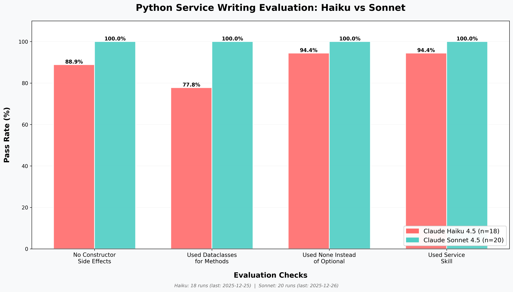
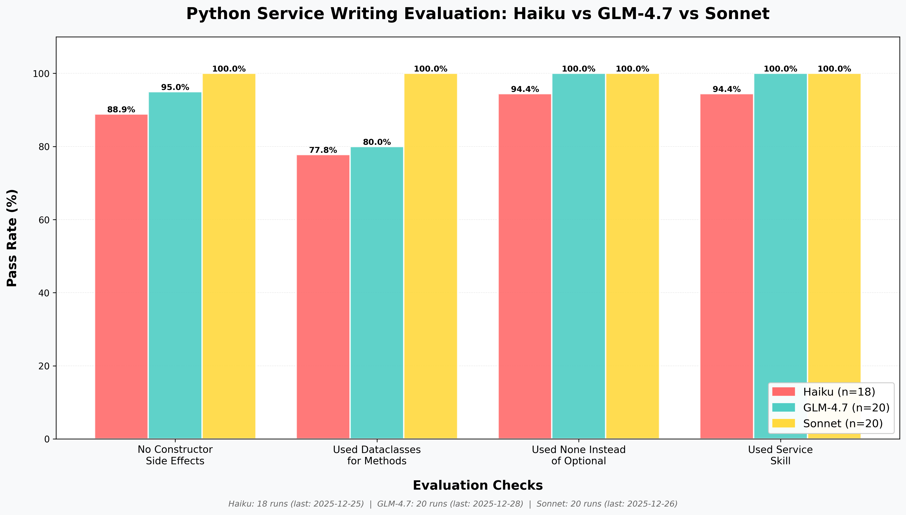

# Writing services eval

Writing a service is a [Claude Code Skill](https://platform.claude.com/docs/en/agents-and-tools/agent-skills/overview) that I am testing. In my skill prompt, I have a variety of requirements that need to be followed to create a service in the way that I like, and my evaluation ensures that the skill actually adheres to my requirements.

- Uses the [Claude Code Agent SDK](https://platform.claude.com/docs/en/agent-sdk/overview) to simulate a Claude Code session
- Experiment tracking is done through a logger service to measure the effect of prompt changes

# Insights

## Haiku 4.5 is not as good as Sonnet 4.5 at instruction following for simple skills

## GLM-4.7 is better than Haiku but not as good as Sonnet

Using [OpenRouter's Claude Code Integration](https://openrouter.ai/docs/guides/guides/claude-code-integration) I tested GLM-4.7 with the same Claude Code harness.

NOTE: I haven't changed the prompt for this; given that this is a different model family, it may require different prompting.

Cost to run GLM-4.7 on eval: `$2.75`

